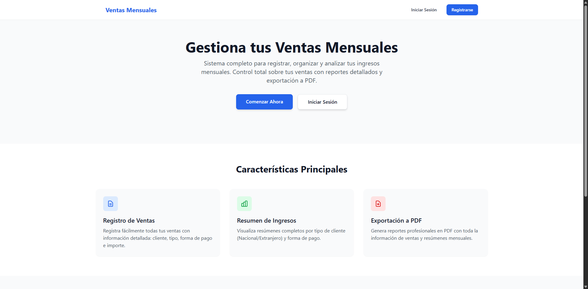
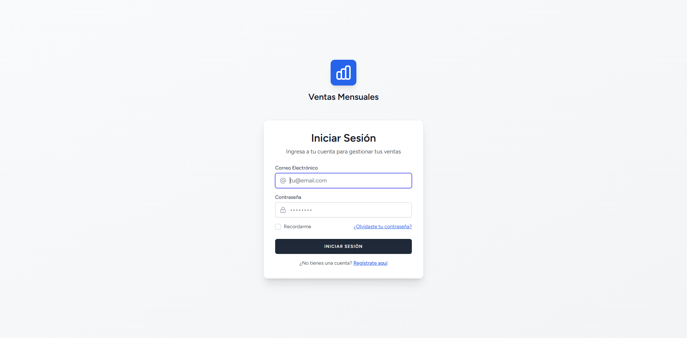
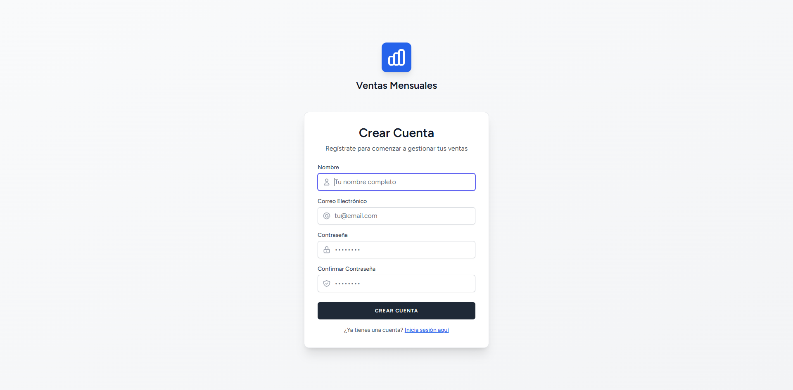
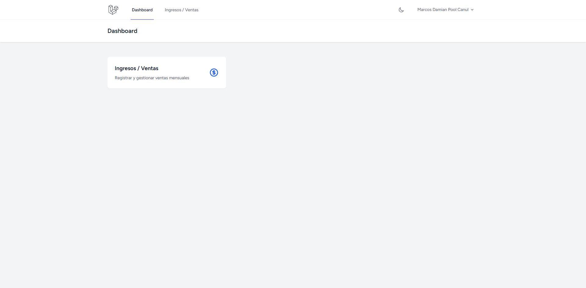
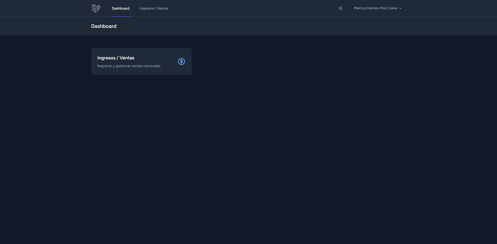
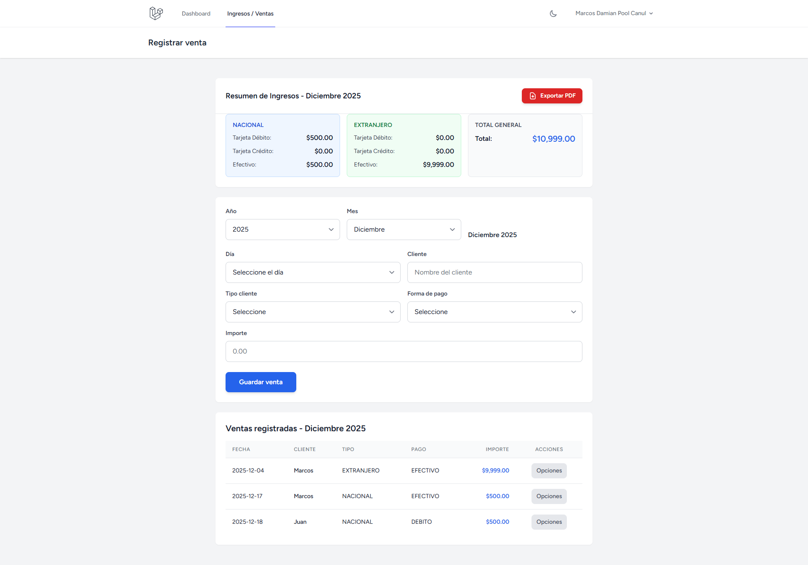
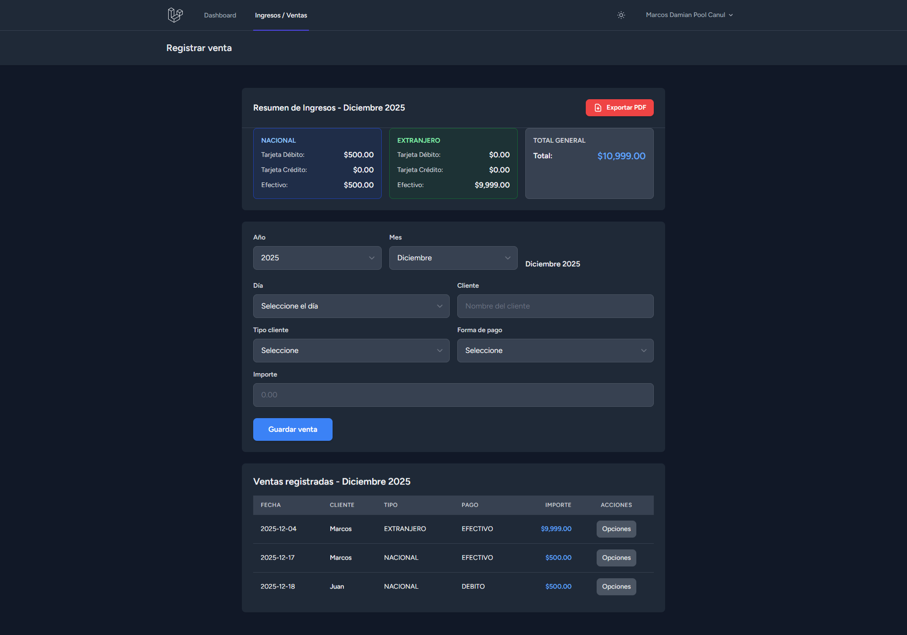

# Sistema de Ventas Mensuales

Una aplicación web moderna y completa para gestionar y registrar ventas mensuales. Construida con Laravel 12, Tailwind CSS y Alpine.js, con una interfaz intuitiva, responsive y soporte para modo claro/oscuro.

---

## Descripción

Sistema de Ventas Mensuales es una aplicación web que permite registrar, organizar y analizar ingresos mensuales de manera eficiente. La aplicación permite gestionar ventas clasificadas por tipo de cliente (Nacional/Extranjero) y forma de pago (Efectivo, Débito, Crédito), con resúmenes automáticos y exportación de reportes en PDF.

## Capturas de pantalla

### Página de inicio



### Autenticación

#### Login



#### Registro



### Dashboard

#### Modo claro



#### Modo oscuro



### Gestión de ventas

#### Modo claro



#### Modo oscuro



### Exportación a PDF

Ejemplo de reporte PDF generado:

[📄 Ver ejemplo de PDF exportado](public/images/ventas_Diciembre_2025.pdf)

## Características principales

-   **Registro de ventas**: Registro fácil y rápido de ventas con información detallada (cliente, tipo, forma de pago, importe)
-   **Resumen automático**: Cálculo automático de totales por tipo de cliente y forma de pago
-   **Filtros por mes y año**: Visualización de ventas filtradas por período específico (2025-2030)
-   **Exportación a PDF**: Generación de reportes profesionales en PDF con resumen y lista completa de ventas
-   **Interfaz responsive**: Diseño adaptado para dispositivos móviles, tablets y escritorio
-   **Modo claro/oscuro**: Toggle para cambiar entre modo claro y oscuro con persistencia en localStorage
-   **Acordeón móvil**: Resumen de ingresos colapsable en dispositivos móviles para ahorrar espacio
-   **Autenticación segura**: Sistema de login y registro con Laravel Breeze
-   **Gestión de perfil**: Edición de perfil de usuario y cambio de contraseña

## Tecnologías utilizadas

-   **Laravel 12** - Framework PHP moderno [https://laravel.com/](https://laravel.com/)
-   **PHP 8.2+** - Lenguaje de programación [https://www.php.net/](https://www.php.net/)
-   **Tailwind CSS 3** - Framework de CSS utilitario [https://**tailwindcss**.com/](https://tailwindcss.com/)
-   **Alpine.js 3** - Framework JavaScript ligero [https://alpinejs.dev/](https://alpinejs.dev/)
-   **DomPDF** - Generación de PDFs [https://github.com/barryvdh/laravel-dompdf](https://github.com/barryvdh/laravel-dompdf)
-   **Laravel Breeze** - Autenticación y scaffolding [https://laravel.com/docs/breeze](https://laravel.com/docs/breeze)
-   **SQLite** - Base de datos ligera [https://www.sqlite.org/](https://www.sqlite.org/)
-   **Vite 7** - Herramienta de construcción rápida [https://vitejs.dev/](https://vitejs.dev/)

## Herramientas utilizadas

-   **Composer** - Gestor de dependencias PHP
-   **NPM** - Gestor de paquetes Node.js
-   **Git** - Control de versiones
-   **Laravel Pint** - Formateador de código PHP
-   **PHPUnit** - Framework de pruebas

---

## Instrucciones para iniciar el proyecto

### Prerrequisitos

-   PHP 8.2 o superior
-   Composer
-   Node.js 18 o superior
-   NPM o pnpm

### Variables de entorno

Crea un archivo `.env` en la raíz del proyecto basándote en `.env.example`:

```env
APP_NAME="Sistema de Ventas Mensuales"
APP_ENV=local
APP_KEY=
APP_DEBUG=true
APP_URL=http://localhost

DB_CONNECTION=sqlite
DB_DATABASE=database/database.sqlite

BROADCAST_DRIVER=log
CACHE_DRIVER=file
FILESYSTEM_DISK=local
QUEUE_CONNECTION=sync
SESSION_DRIVER=file
SESSION_LIFETIME=120
```

### Instalación

1. **Clona el repositorio**

    ```bash
    git clone https://github.com/tu-usuario/ventas-mensuales.git
    cd ventas-mensuales
    ```

2. **Instala las dependencias de PHP**

    ```bash
    composer install
    ```

3. **Crea el archivo de entorno**

    ```bash
    cp .env.example .env
    ```

4. **Genera la clave de aplicación**

    ```bash
    php artisan key:generate
    ```

5. **Crea la base de datos SQLite**

    ```bash
    touch database/database.sqlite
    ```

    O en Windows:

    ```bash
    type nul > database\database.sqlite
    ```

6. **Ejecuta las migraciones**

    ```bash
    php artisan migrate
    ```

7. **Instala las dependencias de Node.js**

    ```bash
    npm install
    ```

8. **Compila los assets**

    ```bash
    npm run build
    ```

9. **Inicia el servidor de desarrollo**

    ```bash
    php artisan serve
    ```

    Y en otra terminal, inicia Vite:

    ```bash
    npm run dev
    ```

10. **Abre tu navegador**

    ```text
    http://localhost:8000
    ```

### Estructura del proyecto

```text
ventas-mensuales/
├── app/
│   ├── Http/
│   │   └── Controllers/
│   │       ├── IngresoVentaController.php    # Controlador principal de ventas
│   │       ├── ProfileController.php         # Gestión de perfil
│   │       └── Auth/                         # Controladores de autenticación
│   ├── Models/
│   │   ├── IngresoVenta.php                  # Modelo de ventas
│   │   └── User.php                          # Modelo de usuario
│   └── Providers/
│       └── AppServiceProvider.php
├── database/
│   ├── migrations/                           # Migraciones de base de datos
│   │   └── 2025_12_17_004940_create_venta_mensuals_table.php
│   ├── seeders/                              # Seeders de base de datos
│   └── database.sqlite                       # Base de datos SQLite
├── resources/
│   ├── views/
│   │   ├── ingresos_ventas/                  # Vistas de ventas
│   │   │   ├── create.blade.php              # Registro de ventas
│   │   │   ├── edit.blade.php                # Edición de ventas
│   │   │   ├── index.blade.php               # Listado de ventas
│   │   │   └── pdf.blade.php                 # Plantilla PDF
│   │   ├── auth/                             # Vistas de autenticación
│   │   ├── layouts/                          # Layouts principales
│   │   ├── components/                       # Componentes reutilizables
│   │   ├── dashboard.blade.php               # Dashboard principal
│   │   └── welcome.blade.php                 # Página de inicio
│   ├── css/
│   │   └── app.css                           # Estilos principales
│   └── js/
│       ├── app.js                            # JavaScript principal
│       └── bootstrap.js                     # Configuración de Alpine.js
├── routes/
│   ├── web.php                               # Rutas web
│   └── auth.php                              # Rutas de autenticación
├── public/                                   # Archivos públicos
├── config/                                   # Archivos de configuración
├── tailwind.config.js                        # Configuración de Tailwind
├── vite.config.js                            # Configuración de Vite
├── composer.json                             # Dependencias PHP
├── package.json                              # Dependencias Node.js
└── README.md                                 # Este archivo
```

### Scripts disponibles

#### Composer (PHP)

```bash
composer install          # Instala dependencias PHP
composer update           # Actualiza dependencias PHP
composer setup            # Instalación completa del proyecto
composer dev              # Inicia servidor, queue, logs y Vite
composer test             # Ejecuta las pruebas
```

#### NPM

```bash
npm install               # Instala dependencias Node.js
npm run dev              # Inicia Vite en modo desarrollo
npm run build            # Compila assets para producción
```

#### Artisan (Laravel)

```bash
php artisan serve        # Inicia el servidor de desarrollo
php artisan migrate      # Ejecuta las migraciones
php artisan migrate:fresh # Reinicia la base de datos
php artisan key:generate # Genera la clave de aplicación
php artisan route:list   # Lista todas las rutas
php artisan tinker       # Abre la consola interactiva
```

### Solución de problemas comunes

1. **Error de permisos en SQLite**

    - Asegúrate de que el archivo `database/database.sqlite` tenga permisos de escritura
    - En Linux/Mac: `chmod 664 database/database.sqlite`

2. **Error de puerto ocupado**

    - Cambia el puerto del servidor: `php artisan serve --port=8001`
    - O cambia el puerto de Vite en `vite.config.js`

3. **Errores de dependencias**

    - Elimina `vendor/` y `node_modules/`
    - Reinstala: `composer install && npm install`

4. **Problemas de cache**

    - Limpia la cache: `php artisan cache:clear`
    - Limpia la cache de configuración: `php artisan config:clear`
    - Limpia la cache de vistas: `php artisan view:clear`

5. **Error "APP_KEY not set"**

    - Genera la clave: `php artisan key:generate`

6. **Assets no se cargan**

    - Asegúrate de que Vite esté corriendo: `npm run dev`
    - O compila los assets: `npm run build`

7. **Error de migraciones**

    - Si la base de datos existe, haz fresh: `php artisan migrate:fresh`
    - Asegúrate de que el archivo SQLite existe

---

## Uso

### Registro de ventas

1. **Accede al sistema**: Inicia sesión o regístrate si no tienes cuenta
2. **Selecciona período**: Elige el mes y año (2025-2030) para registrar ventas
3. **Completa el formulario**:
    - Selecciona el día del mes
    - Ingresa el nombre del cliente
    - Selecciona el tipo de cliente (Nacional/Extranjero)
    - Selecciona la forma de pago (Efectivo/Débito/Crédito)
    - Ingresa el importe
4. **Guarda la venta**: Haz clic en "Guardar venta"

### Visualización de ventas

-   **Resumen de ingresos**: Se muestra automáticamente en la parte superior con totales por:
    -   Tipo de cliente (Nacional/Extranjero)
    -   Forma de pago (Débito/Crédito/Efectivo)
    -   Total general
-   **Lista de ventas**: Todas las ventas del mes seleccionado se muestran en una tabla (desktop) o cards (móvil)
-   **Filtros**: Cambia el mes o año usando los selectores en la parte superior

### Edición y eliminación

-   **Editar**: Haz clic en "Editar" en cualquier venta para modificar sus datos
-   **Eliminar**: Haz clic en "Eliminar" y confirma para borrar una venta

### Exportación a PDF

1. **Selecciona el período**: Asegúrate de tener el mes y año correctos
2. **Haz clic en "Exportar PDF"**: Botón ubicado en el resumen de ingresos
3. **Descarga el PDF**: Se generará un archivo con:
    - Resumen completo de ingresos
    - Lista detallada de todas las ventas del mes
    - Total general
    - Fecha de generación

**Ejemplo de PDF generado:**

[📄 Descargar ejemplo de PDF](public/images/ventas_Diciembre_2025.pdf)

### Modo claro/oscuro

-   **Toggle**: Haz clic en el icono de sol/luna en la barra de navegación
-   **Persistencia**: Tu preferencia se guarda automáticamente
-   **Aplicación global**: El modo se aplica a todas las páginas

---

## Características de la interfaz

-   **Diseño moderno**: Interfaz elegante con Tailwind CSS y componentes personalizados
-   **Responsive**: Adaptado para móviles, tablets y escritorio
-   **Acordeón móvil**: Resumen de ingresos colapsable en dispositivos móviles
-   **Feedback visual**: Mensajes de éxito y validación claros
-   **Animaciones suaves**: Transiciones y efectos hover para mejor UX
-   **Tablas responsivas**: Vista de tabla en desktop, cards en móvil
-   **SEO optimizado**: Meta tags y estructura semántica

---

## Modelo de datos

### IngresoVenta

-   `id` - Identificador único
-   `fecha_venta` - Fecha de la venta (YYYY-MM-DD)
-   `anio` - Año de la venta
-   `mes` - Mes de la venta (1-12)
-   `nombre_cliente` - Nombre del cliente
-   `tipo_cliente` - Tipo: NACIONAL o EXTRANJERO
-   `forma_pago` - Forma de pago: EFECTIVO, DEBITO o CREDITO
-   `importe` - Monto de la venta (decimal)
-   `archivado` - Estado de archivo (boolean)
-   `created_at` - Fecha de creación
-   `updated_at` - Fecha de actualización

---

## Rutas principales

-   `/` - Página de inicio
-   `/dashboard` - Dashboard principal (requiere autenticación)
-   `/ingresos-ventas/create` - Registrar nueva venta
-   `/ingresos-ventas` - Listado de todas las ventas
-   `/ingresos-ventas/{id}/edit` - Editar venta
-   `/ingresos-ventas/exportar/pdf` - Exportar PDF del mes/año seleccionado
-   `/login` - Iniciar sesión
-   `/register` - Registrarse
-   `/profile` - Editar perfil

---

## Autor

Marcos Pool

---

## Notas

Desarrollado con ❤️ usando Laravel, Tailwind CSS y Alpine.js
